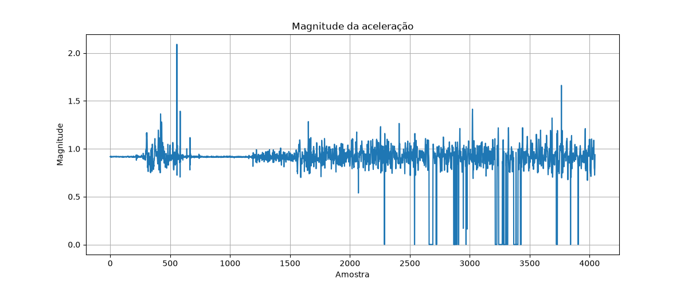
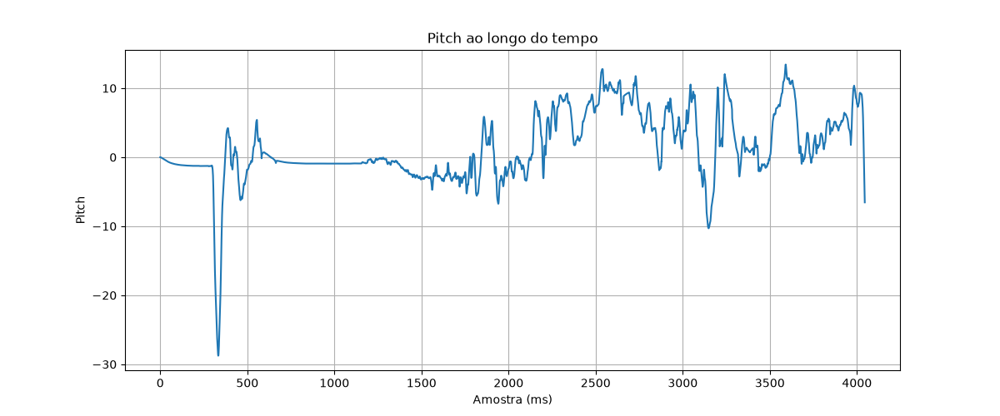
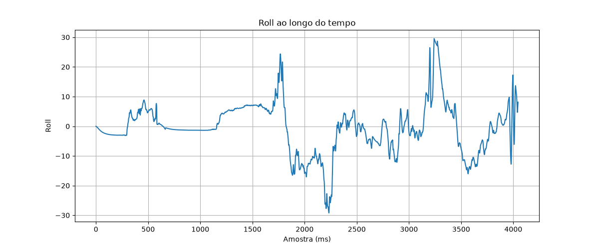

# Experimento 001

Data: 15/06/2026

## Objetivo

Validar a coleta de dados do MPU6050 e identificar qual variável apresenta o melhor padrão para detecção de passos.

## Gráficos

### Magnitude

### Pitch

### Roll

### AX

### AY

## Análise

### Magnitude

- [ ] Possui picos claros
- [ ] Possui ruído excessivo
- [ ] Possui valores inválidos

### Pitch

- [ ] Possui padrão repetitivo
- [ ] Possui baixa quantidade de ruído

### Roll

- [ ] Possui padrão repetitivo
- [ ] Possui baixa quantidade de ruído

### AX

- [ ] Possui padrão repetitivo
- [ ] Possui baixa quantidade de ruído

### AY

- [ ] Possui padrão repetitivo
- [ ] Possui baixa quantidade de ruído

## Conclusão

Variável candidata para detecção de passos:

Pendente.