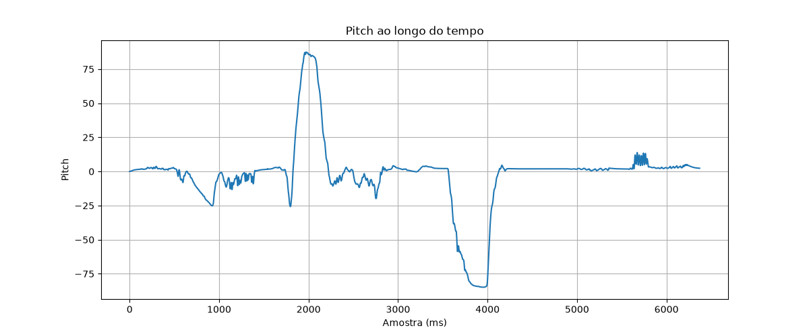
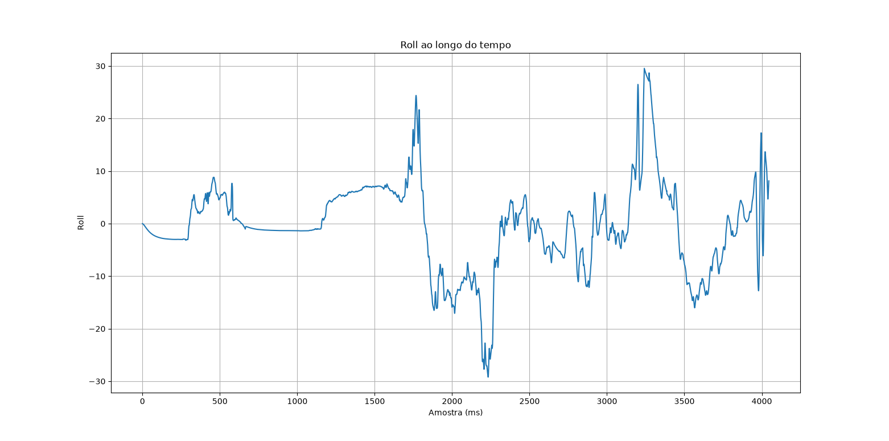

# Experimento 002

Data: 16/06/2026

## Objetivo

Validar a coleta de dados do MPU6050 e identificar qual variável apresenta o melhor padrão para detecção de passos.

## Gráficos

### Magnitude

### Pitch

### Roll

### AX

### AY

## Conclusão

Variável candidata para detecção de passos:

Pendente.
